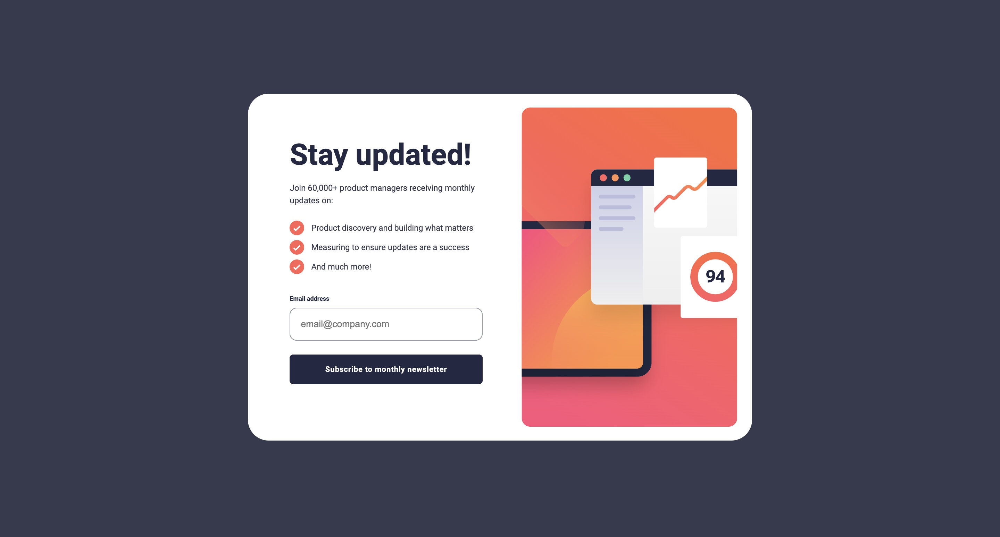
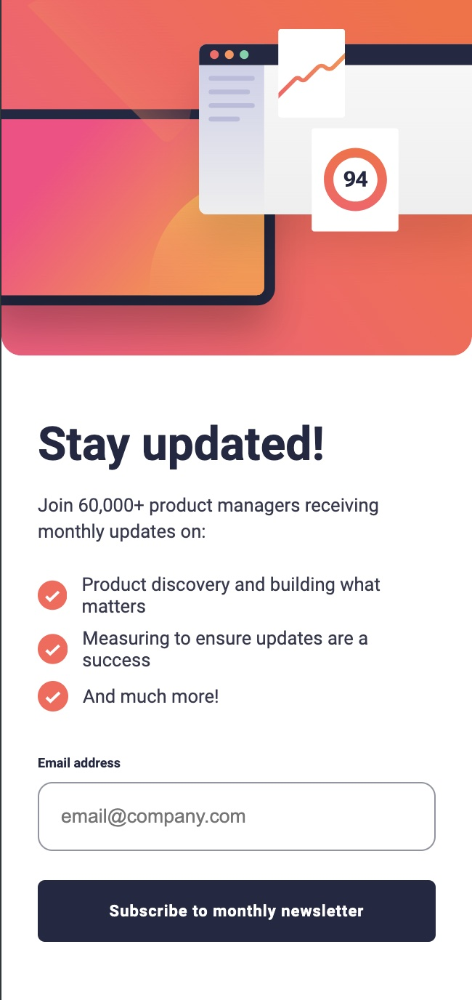

## Table of contents

- [Overview](#overview)
  - [The challenge](#the-challenge)
  - [Screenshot](#screenshot)
  - [Links](#links)
- [My process](#my-process)
  - [Built with](#built-with)
  - [What I learned](#what-i-learned)
  - [Continued development](#continued-development)
- [Author](#author)


## Overview

### The challenge

Users should be able to:

- Add their email and submit the form
- See a success message with their email after successfully submitting the form
- See form validation messages if:
  - The field is left empty
  - The email address is not formatted correctly
- View the optimal layout for the interface depending on their device's screen size
- See hover and focus states for all interactive elements on the page

### Screenshot






### Links

- Solution URL: [F.M Solution](https://www.frontendmentor.io/solutions/newsletter-sign-up-form-design-Pu1OEgSd9d)
- Live Site URL: [Github!](https://clipzorama.github.io/Newsletter-Sign-Up-Form/)

## My process

### Built with

- Semantic HTML5 markup
- CSS custom properties
- Flexbox
- Mobile-first workflow
- Email validation to ensure correct input.
- A dynamic confirmation message triggered via DOM manipulation.


### What I learned

- Improved skills in validating user inputs with regular expressions in JavaScript.

- Learned how to handle responsive behaviors dynamically using JavaScript.

- Created event listeners to handle user actions like dismissing the confirmation message and adjusting UI elements.

```html
<div class="info">
  <h2 class="update">Stay updated!</h2>
  <p class="join">Join 60,000+ product managers receiving monthly updates on:</p>
  <div class="featured-lists">
  <div class="featured-item">
  <p class="featured-p">And much more!</p>
  </div>
  </div>
  <div class="labeler">
  <label class="email-label" for="email">Email address</label>
  <span class="error-msg">Valid email required</span>
  </div>
  <input type="email" name="email" id="email" placeholder="email@company.com" required>
  <button class="subscribe">Subscribe to monthly newsletter</button>
</div>
```

```css
.confirmation {
    background-color: var(--White);
    width: 25%;
    border-radius: 25px;
    flex-direction: column;
    padding: 45px;
    box-sizing: border-box;
    display: none;

}

.successor {
    position: relative;
    top: -20px;
}

.thanks {
    color: var(--Dark-Slate-Grey);
    font-family: "RobotoB";
    font-size: 2.6rem;
    margin-bottom: 20px;
    line-height: 2.7rem;
}
```

```js
const mediaQuery = window.matchMedia("(max-width: 600px)");

function mediaChanger(event) {

    if (event.matches) {
        imager.innerHTML = newSVG;
    } else {
        imager.innerHTML = oldSVG;
    }
}

mediaQuery.addEventListener("change", mediaChanger); 
mediaChanger(mediaQuery);
```

### Continued development

**Improving Form Validation Techniques:**
Deeper ways of handling errors and adding user-friendly error messages.

**Enhanced Animations:**
Implement smoother transitions and animations for feedback, like sliding confirmations or fading out forms.

**Reusable Components:**
Develop reusable components (buttons, input fields) with tools like React or Web Components.

**Accessibility Improvements:**
Focus on making forms more accessible with ARIA roles and keyboard navigations. Utilzing ARIA is something that I'd have to keep working on but definitely would be useful for this design for future designing

**State Management:**
As I work on larger projects, improve how I handle the state of forms and feedback messages Use libraries like Redux or Context API to improve the state of forms and feedback as well.


## Author

- Frontend Mentor - [@Clipzorama](https://www.frontendmentor.io/profile/Clipzorama)


